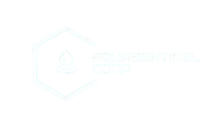
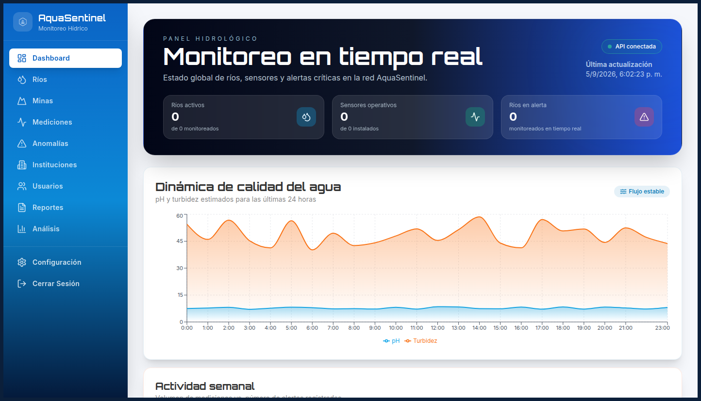

<a id="readme-top"></a>
<!-- SHIELDS -->

<p align='center'> 
  &nbsp;
  &nbsp;
  &nbsp;
  &nbsp;
</p>

<!-- PROJECT LOGO -->
<br>
<div align="center">
   
   <h3 align="center">AquaSentinel</h3>
   <p align="center">
     Real-time river water quality monitoring for the Amazon
     <br>
     <a href="https://github.com/hexed-AAL1X/AquaSentinel"><strong>Explore the docs »</strong></a>
     <br>
     <br>
     <a href="https://github.com/hexed-AAL1X/AquaSentinel">View Demo</a>
     ·
     <a href="https://github.com/hexed-AAL1X/AquaSentinel/issues/new?labels=bug&template=bug-report---.md">Report Bug</a>
     ·
     <a href="https://github.com/hexed-AAL1X/AquaSentinel/issues/new?labels=enhancement&template=feature-request---.md">Request Feature</a>
   </p>
</div>

<!-- TABLE OF CONTENTS -->
<details>
  <summary>Table of Contents</summary>
  <ol>
    <li>
      <a href="#about-the-proyect">About The Project</a>
      <ul>
        <li>
          <a href="#built-with">Built With</a>
        </li>
      </ul>
    </li>
    <li><a href="#important-notices">Important Notices</a></li>
    <li>
      <a href="#getting-started">Getting Started</a>
      <ul>
        <li><a href="#prerequisites">Prerequisites</a></li>
        <li><a href="#installation">Installation</a></li>
      </ul>
    </li>
    <li>
      <a href="#contributing">Contributing</a>
      <ul>
        <li>
          <a href="#top-contributors">Top Contributors</a>
        </li>
      </ul>
    </li>
    <li><a href="#contact">Contact</a></li>
  </ol>
</details>
<br>

<!-- ABOUT THE PROJECT -->
<a id="about-the-proyect"></a>***About The Project***


<div align="center">
  
</div>

AquaSentinel is a web platform for monitoring river water quality and detecting mercury contamination linked to illegal mining in Madre de Dios. The frontend delivers dashboards, alerts, maps, and sensor health views so teams can protect public health and Amazonian biodiversity with continuous 24/7 visibility.

Here's why:

* Illegal mining releases more than 180 tons of mercury per year in the region — AquaSentinel turns sensor data into clear, actionable insight.
* The UI covers rivers, mines, sensor maintenance, anomaly detection, and reports in a single responsive experience.
* Built as a modern Next.js app with JWT auth, live charts, and Mapbox-powered geography.

Of course, this is an evolving release. Upcoming updates will keep refining performance, visualizations, and operational workflows.

<a id="built-with"></a> 
### Built With
* &nbsp;
* &nbsp;
* &nbsp;
* &nbsp;
* &nbsp;
* &nbsp;
* &nbsp;
<p align="right">(<a href="#readme-top">back to top</a>)</p>

<!-- IMPORTANT NOTICES -->
<a id="important-notices"></a>***Important Notices***


> [!NOTE]  
> To install and run AquaSentinel, make sure you have the following:
> 
> | Requirement        | Description                                                                                       |
> |--------------------|---------------------------------------------------------------------------------------------------|
> | Operative System    |    |
> | Runtime             |  |
> | Package Manager     |  |
> | Backend             | REST API available and CORS configured |
 
> [!IMPORTANT]\
> We are a small team, but we are committed to improving AquaSentinel. Expect continuous updates to strengthen monitoring accuracy, UI performance, and field operations support.
<p align="right">(<a href="#readme-top">back to top</a>)</p>

<!-- GETTING STARTED -->
<a id="getting-started"></a>***Getting Started***

These are instructions on how to configure your project locally. To get a local copy up and running, follow these simple example steps.

<a id="prerequisites"></a>
### Prerequisites
These are the items needed to use the software and how to install them:
* [Node.js](https://nodejs.org/) 18+ (LTS recommended)
* npm (bundled with Node.js)
* A running AquaSentinel API (or a compatible REST backend)

<a id="installation"></a>
### Installation
_Below is an example of how to install and configure AquaSentinel on your local machine._

1. Clone the repository
   ```sh
   git clone https://github.com/hexed-AAL1X/AquaSentinel.git
   ```
2. Navigate to the project directory
   ```sh
   cd AquaSentinel
   ```
3. Install dependencies
   ```sh
   npm install
   ```
4. Create a `.env.local` file in the project root with your values:
   ```env
   NEXT_PUBLIC_API_URL=http://localhost/api
   NEXT_PUBLIC_MAPBOX_TOKEN=your_mapbox_token
   ```
5. Run the development server
   ```sh
   npm run dev
   ```
6. Open [http://localhost:3000](http://localhost:3000) in your browser

7. (Optional) Change the Git remote URL to prevent accidental pushes to the base project
   ```sh
   git remote set-url origin https://github.com/tu_usuario/AquaSentinel
   git remote -v #confirm the changes
   ```

### Production
```sh
npm run build
npm start
```
<p align="right">(<a href="#readme-top">back to top</a>)</p>

<!-- CONTRIBUTING -->
<a id="contributing"></a>***Contributing***

Contributions are what make the open source community an amazing place to learn, be inspired, and create. Any contribution you wish to make is very welcome!

If you have a suggestion to improve the project, you can fork the repository and open a pull request.
Don't forget to give the project a star! Thanks for contributing!

1. Fork the project.
2. Create a branch for your improvement (`git checkout -b feature/NewImprovement`).
3. Make your changes and commit (`git commit -m 'Add New Improvement'`).
4. Push your changes to the branch (`git push origin feature/NewImprovement`).
5. Open a pull request.

<a id="top-contributors"></a>
### Top contributors:
<div align="center">
  <a href="https://github.com/hexed-AAL1X"></a>
</div>
<p align="right">(<a href="#readme-top">back to top</a>)</p>

<!-- CONTACT -->
<a id="contact"></a>***Contact***

<p align="center">
  <a href="mailto:hexed_aal1x.ops@proton.me"></a>
  <a href="https://www.instagram.com/hexed_aal1x"></a>
  <a href="https://www.linkedin.com/in/leonardo-bravo-4120b8228/"></a>
</p>
<p align="right">(<a href="#readme-top">back to top</a>)</p>
